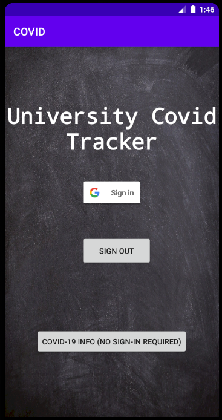

# AndroidCOVIDApp

Created by Joshua Bone and Salem Bugshan

EC463 - Sr. Design Miniproject 

Boston University

# Info

Instrumentation tests are located under the files app/src/androidTests. 
The app was tested on an Google Pixel 3 emulator.

app/src/main/java/com/example/covid/ contains all functional (non-test) code.

The project is structured as follows:

MainActivity is displayed on startup which is the first page. From here you can either sign in, or go to the Info Dashboard (infoDashActivity), which contains information pulled from covid19api.com. Because this api is rate-limited, it may display all zeros if requests are sent too frequently.

If you log-in from the MainActivity screen, you will be taken to one of two places.

(1) If you are not listed as an admin, you are assumed to be a student, and you are taken to the SymptomSurveyActivity. Here, you fill out and submit a survey regarding COVID-19 symptoms. This data is securely stored in Firebase's Real Time Database.

(2) If you are listed as an admin, you will be taken to the AdminActivity, which shows you which students have not completed the survey. From here you can move back and forth to the SymptomDashboard, which shows you which students have completed the survey, and are symptomatic.

note: this project is not HIPAA-compliant, and has been developed for educational purposes only.

# Screenshots

Below are screenshots of what the app would look like.

This is a screenshot of the login screen. This activity is launched on startup.

This is a screenshot of the survey screen.

Here we display the students who have not completed the survey:

Here is the (API) info dashboard, after we hit the rate limit during testing:

Unfortunately, I didn't grab a screenshot before the rate-limit was hit, when it was displaying real data. The app takes some time to work so please be patient.

# External Dependencies:

We use Espresso for instrumentation tests.

We use Retrofit 2 for api requests from covid19api.com

Firebase is used for google sign-on, and we also take advantage of their Real Time Database to store the results of students' symptom-survey.
